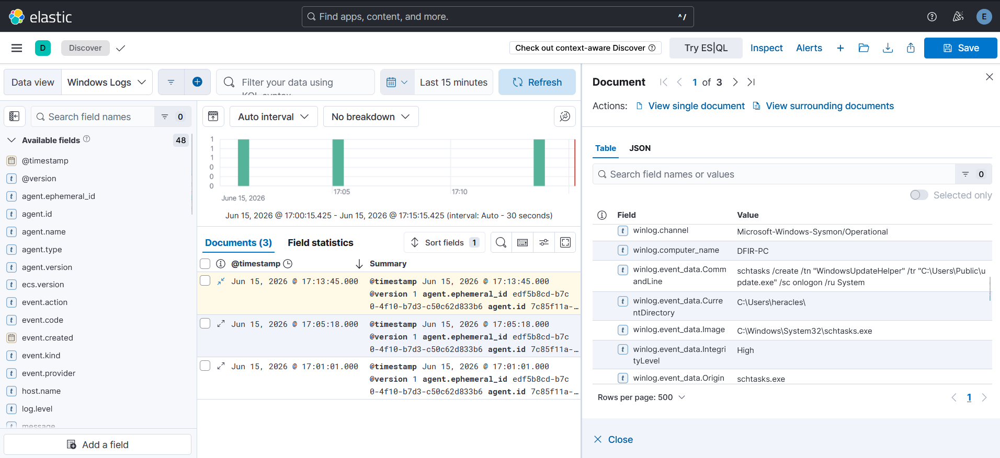
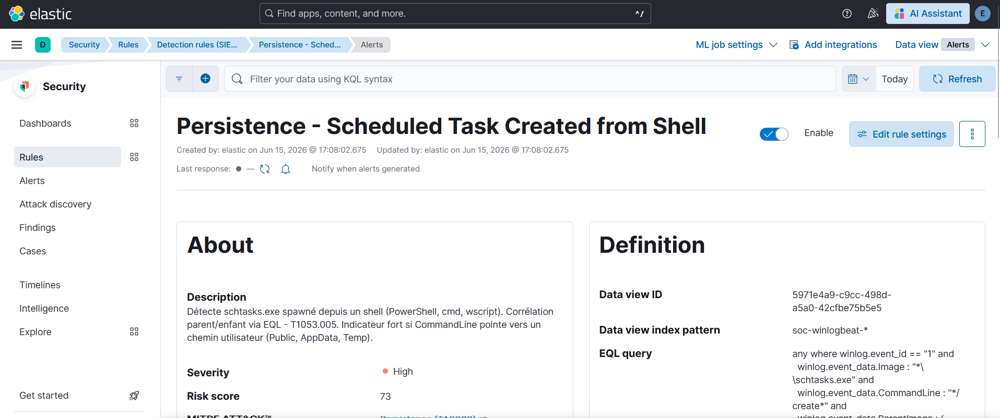
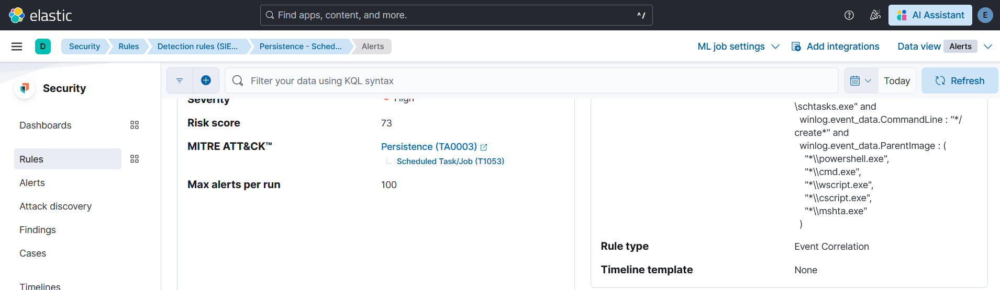
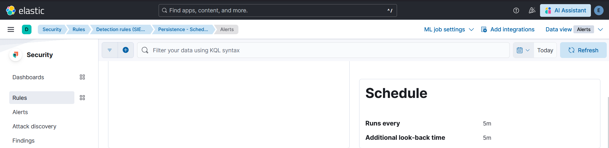
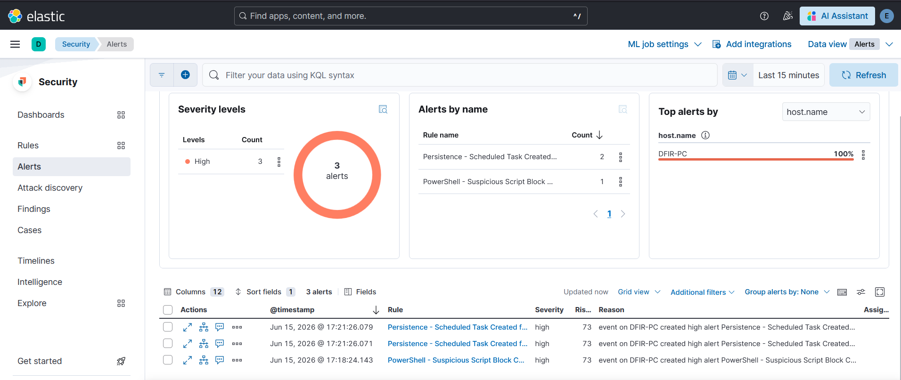

# Cas 03 - Scheduled Task créée depuis un shell : persistence

## Technique ATT&CK

- **T1053.005** - Scheduled Task/Job: Scheduled Task (Persistence, TA0003)

## Hypothèse de détection

`schtasks.exe` est l'outil en ligne de commande standard pour créer des tâches planifiées sur Windows. Son invocation légitime provient typiquement d'installeurs, de Windows Update, ou de scripts d'administration avec des comptes de service dédiés. Lorsque `schtasks.exe` est spawné par un shell interactif (`powershell.exe`, `cmd.exe`, `wscript.exe`, `cscript.exe`, `mshta.exe`), c'est un indicateur fort de persistence : un attaquant qui a obtenu une exécution code cherche à maintenir son accès.

L'hypothèse : `schtasks.exe /create` spawné depuis un shell interactif est suffisamment anormal pour justifier une alerte High.

## Data source

- **Event ID Sysmon 1** - Process Create
- **Channel** : `Microsoft-Windows-Sysmon/Operational`
- **Champs discriminants** : `winlog.event_data.Image` (process enfant), `winlog.event_data.CommandLine` (arguments), `winlog.event_data.ParentImage` (process parent)

Point important : le Sysmon Event ID 1 embarque à la fois les informations du process créé (`Image`, `CommandLine`) **et** du process parent (`ParentImage`, `ParentCommandLine`) dans le **même event**. Cela signifie que la relation parent-enfant est interrogeable dans une seule requête sans corrélation de plusieurs events.

## Méthode de test

Test réalisé par **injection synthétique** d'un log Sysmon EID 1 directement dans Elasticsearch.

```bash
curl -s -X POST "https://localhost:9200/soc-winlogbeat-test/_doc" \
  -H "Content-Type: application/json" \
  -u "elastic:<ELASTIC_PASSWORD>" \
  --cacert /etc/elasticsearch/certs/http_ca.crt \
  -d '{
    "@timestamp": "'"$(date -u +%Y-%m-%dT%H:%M:%S.000Z)"'",
    "winlog": {
      "channel": "Microsoft-Windows-Sysmon/Operational",
      "event_id": "1",
      "computer_name": "DFIR-PC",
      "event_data": {
        "Image": "C:\\Windows\\System32\\schtasks.exe",
        "CommandLine": "schtasks /create /tn \"MaintTask\" /tr \"C:\\Users\\Public\\tasksche.exe\" /sc onlogon /f",
        "ParentImage": "C:\\Windows\\System32\\WindowsPowerShell\\v1.0\\powershell.exe",
        "ParentCommandLine": "powershell.exe -NoProfile -ExecutionPolicy Bypass"
      }
    },
    "agent": { "name": "DFIR-PC" },
    "host": { "name": "DFIR-PC" }
  }'
```

## Vérification dans Discover

Le log injecté apparaît dans Kibana Discover avec la relation parent-enfant visible dans le même document.



## Règle custom

Nom : **Persistence - Scheduled Task Created from Shell**

```eql
any where winlog.event_id == "1" and
  winlog.event_data.Image : "*\\schtasks.exe" and
  winlog.event_data.CommandLine : "*/create*" and
  winlog.event_data.ParentImage : (
    "*\\powershell.exe",
    "*\\cmd.exe",
    "*\\wscript.exe",
    "*\\cscript.exe",
    "*\\mshta.exe"
  )
```

- **Langage** : EQL
- **Rule type** : Event Correlation
- **Severity** : High
- **Risk score** : 73
- **Index pattern** : `soc-winlogbeat*`







### Note sur le choix EQL vs KQL

La règle est écrite en EQL avec `any where` - c'est-à-dire une requête **sur un seul event**, sans séquence. Ce choix mérite d'être explicité, car il a été l'occasion d'une clarification importante sur ces deux langages.

**EQL est nécessaire pour corréler des events distincts** (ex. "un process création suivi d'une connexion réseau dans les 2 minutes" - voir Cas 05). **KQL est suffisant pour interroger plusieurs champs d'un même event.** Puisque Sysmon EID 1 embarque simultanément `Image` (enfant) et `ParentImage` (parent), une requête KQL aurait produit exactement le même résultat :

```kql
winlog.event_id : "1" and
winlog.event_data.Image : "*\\schtasks.exe" and
winlog.event_data.CommandLine : "*/create*" and
winlog.event_data.ParentImage : ("*\\powershell.exe" or "*\\cmd.exe" or "*\\wscript.exe" or "*\\cscript.exe" or "*\\mshta.exe")
```

La règle EQL a été conservée telle quelle dans le lab (la règle fonctionne correctement), mais cette nuance est documentée ici car elle illustre un pattern de décision concret : choisir EQL uniquement quand la corrélation multi-events est réellement nécessaire.

## Validation

La règle a généré des alertes High sur l'hôte `DFIR-PC`. La vue Alerts montre également des alertes du cas 02 (PowerShell SBL) provenant de la même session de test.



## Limites et contournements

**`Register-ScheduledTask` n'est pas couvert.** La cmdlet PowerShell native `Register-ScheduledTask` crée une tâche planifiée via l'API COM directement, sans jamais spawner `schtasks.exe`. Cette règle ne détecte donc qu'une implémentation parmi plusieurs de T1053.005. La couverture complète nécessiterait l'Event 4698 du Windows Security Log ("A scheduled task was created"), qui exige l'activation d'une audit policy spécifique (`auditpol /set /subcategory:"Other Object Access Events"`) non activée par défaut.

**Filtres ParentImage limités.** La liste de parents suspects est fermée : un attaquant passant par un autre interpréteur (`msiexec`, `regsvr32`, un process custom) contournerait la règle. Une approche complémentaire par allowlist (n'autoriser que les parents attendus) serait plus robuste mais génèrerait des faux positifs significatifs dans un environnement réel.

**Chemin de la tâche non filtré.** La description de la règle mentionne que les chemins dans `AppData` ou `Temp` sont des indicateurs forts. L'ajout d'un filtre sur `CommandLine : "*AppData*" or "*Temp*" or "*Users\\Public*"` permettrait de monter en severity sur les cas les plus clairs, au prix d'un risque de faux négatifs sur des chemins moins typiques.
