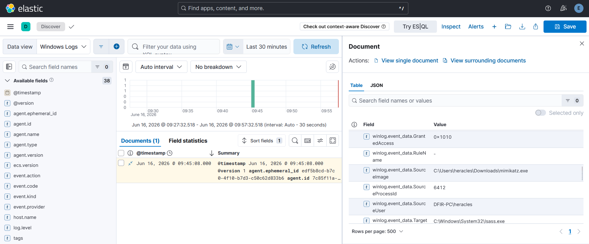
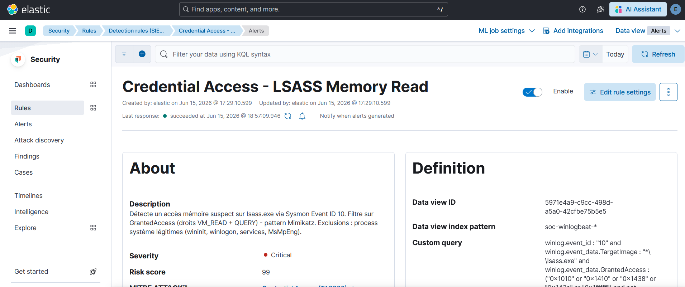
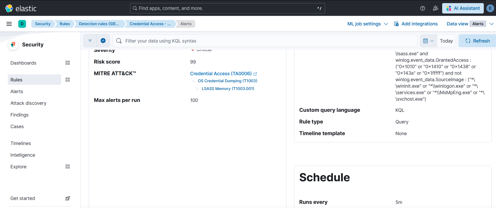
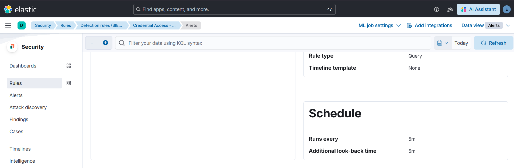
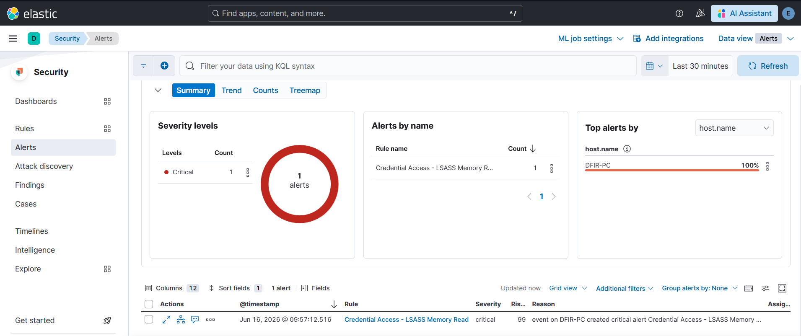

# Cas 04 - Accès mémoire LSASS : credential dumping

## Technique ATT&CK

- **T1003.001** - OS Credential Dumping: LSASS Memory (Credential Access, TA0006)

## Hypothèse de détection

`lsass.exe` (Local Security Authority Subsystem Service) est le process Windows qui gère l'authentification et stocke en mémoire les credentials des sessions actives (hashes NTLM, tickets Kerberos). Des outils comme Mimikatz accèdent à cette mémoire en ouvrant un handle sur le process `lsass.exe` avec des droits élevés via `OpenProcess`.

Le signal discriminant n'est pas le simple fait d'accéder à `lsass.exe` - des process système légitimes (`wininit.exe`, `winlogon.exe`, etc.) le font en permanence - mais la **valeur du `GrantedAccess`** : les droits demandés (`PROCESS_VM_READ`, `PROCESS_QUERY_INFORMATION`, etc.) combinés trahissent une tentative de lecture mémoire plutôt qu'une interaction légitime.

L'hypothèse : un process non whitelisté ouvrant un handle sur `lsass.exe` avec des droits associés à la lecture mémoire (valeurs `GrantedAccess` caractéristiques de Mimikatz et outils similaires) doit générer une alerte Critical.

## Data source

- **Event ID Sysmon 10** - ProcessAccess
- **Channel** : `Microsoft-Windows-Sysmon/Operational`
- **Champs discriminants** :
  - `winlog.event_data.TargetImage` - le process cible (lsass.exe)
  - `winlog.event_data.GrantedAccess` - les droits effectivement accordés sur le handle
  - `winlog.event_data.SourceImage` - le process qui effectue l'accès

Sysmon EID 10 est dédié aux événements d'accès entre process. Il est particulièrement fiable pour ce cas car il est émis au moment de l'ouverture du handle, avant toute lecture mémoire.

## Méthode de test

Test réalisé par **injection synthétique** d'un log Sysmon EID 10 directement dans Elasticsearch, simulant un accès de type Mimikatz avec `GrantedAccess: 0x1010`.

```bash
curl -s -X POST "https://localhost:9200/soc-winlogbeat-test/_doc" \
  -H "Content-Type: application/json" \
  -u "elastic:<ELASTIC_PASSWORD>" \
  --cacert /etc/elasticsearch/certs/http_ca.crt \
  -d '{
    "@timestamp": "'"$(date -u +%Y-%m-%dT%H:%M:%S.000Z)"'",
    "winlog": {
      "channel": "Microsoft-Windows-Sysmon/Operational",
      "event_id": "10",
      "computer_name": "DFIR-PC",
      "event_data": {
        "TargetImage": "C:\\Windows\\System32\\lsass.exe",
        "SourceImage": "C:\\Users\\Attacker\\mimikatz.exe",
        "GrantedAccess": "0x1010",
        "CallTrace": "C:\\Windows\\SYSTEM32\\ntdll.dll+..."
      }
    },
    "agent": { "name": "DFIR-PC" },
    "host": { "name": "DFIR-PC" }
  }'
```

## Vérification dans Discover

Le log injecté apparaît dans Kibana Discover avec `TargetImage: C:\Windows\System32\lsass.exe` et `GrantedAccess: 0x1010`.



## Règle custom

Nom : **Credential Access - LSASS Memory Read**

```kql
winlog.event_id : "10" and
winlog.event_data.TargetImage : "*\\lsass.exe" and
winlog.event_data.GrantedAccess : ("0x1010" or "0x1410" or "0x143a" or "0x1ffff") and
not winlog.event_data.SourceImage : (
  "*\\wininit.exe" or
  "*\\winlogon.exe" or
  "*\\services.exe" or
  "*\\MsMpEng.exe" or
  "*\\svchost.exe"
)
```

- **Langage** : KQL
- **Rule type** : Query
- **Severity** : Critical
- **Risk score** : 99
- **Index pattern** : `soc-winlogbeat*`







Le mapping MITRE configuré : Credential Access (TA0006) > OS Credential Dumping (T1003) > LSASS Memory (T1003.001).

### Signification des valeurs `GrantedAccess`

Les valeurs retenues correspondent à des combinaisons de droits connues pour le credential dumping :

| Valeur | Droits principaux | Usage typique |
|--------|------------------|---------------|
| `0x1010` | `PROCESS_QUERY_LIMITED_INFORMATION` + `PROCESS_VM_READ` | Mimikatz sekurlsa::logonpasswords |
| `0x1410` | `PROCESS_QUERY_INFORMATION` + `PROCESS_VM_READ` | Variante Mimikatz |
| `0x143a` | Combinaison étendue incluant `PROCESS_VM_READ` | Procdump, Task Manager dump |
| `0x1ffff` | `PROCESS_ALL_ACCESS` | Accès complet (rare en conditions légitimes) |

## Validation

La règle a généré **1 alerte Critical** sur l'hôte `DFIR-PC`.



## Limites et contournements

**Les exclusions `SourceImage` sont elles-mêmes un vecteur de bypass.** C'est la limite la plus significative de cette règle. Un attaquant qui injecte son code dans un process whitelisté (`svchost.exe`, `MsMpEng.exe`) avant d'ouvrir le handle sur `lsass.exe` contourne l'exclusion : le `SourceImage` vu par Sysmon sera le process légitime, pas le code malveillant. Ce trade-off entre réduction des faux positifs et robustesse face à l'injection de process est inhérent à cette approche par whitelist.

**La liste `GrantedAccess` couvre Mimikatz classique, pas les techniques modernes.** Les valeurs retenues (`0x1010`, `0x1410`, etc.) correspondent au comportement de Mimikatz et de ses dérivés directs. Des techniques plus avancées utilisent des vecteurs différents :
- **Handle duplication** (`DuplicateHandle`) : un process légitime ouvre le handle, un second le duplique - EID 10 peut ne pas capturer cette séquence correctement.
- **Drivers en mode noyau** (ex. Mimikatz driver, `PROC_THREAD_ATTRIBUTE_MITIGATION_POLICY`) : contournent le monitoring en userland de Sysmon entièrement.
- **`MiniDumpWriteDump` via Task Manager** : génère `GrantedAccess: 0x143a` (inclus dans la règle) mais depuis `taskmgr.exe` qui n'est pas dans la whitelist - ce cas déclencherait bien une alerte.

**Absence de filtre sur `CallTrace`.** Sysmon 10 fournit également le champ `CallTrace`, qui liste les modules ayant participé à l'appel. Une technique connue est de laisser `ntdll.dll` appeler `lsass.exe` sans passer par des modules suspects - filtrer sur `CallTrace` contenant des paths non-système renforcerait la règle, au prix d'une complexité accrue.
