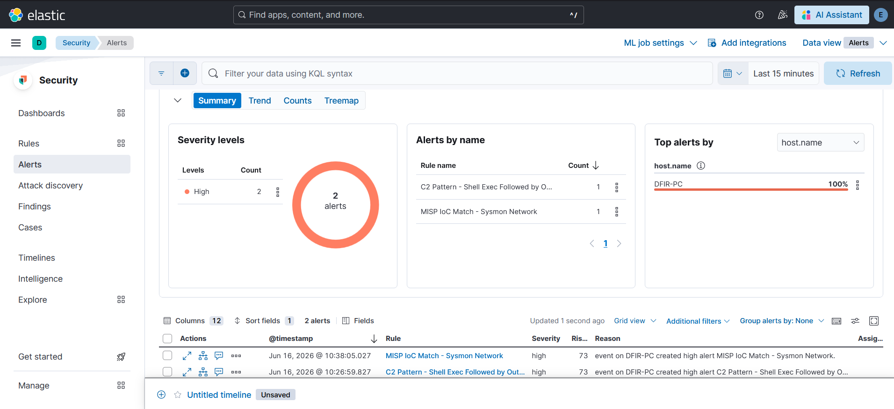

# Cas 05 - MISP IoC Match : corrélation threat intelligence sur connexions réseau

> **Paradigme différent des cas 01 à 04.** Les quatre cas précédents suivent tous le même workflow : simuler une technique ATT&CK, vérifier si une règle prebuilt la couvre, écrire une règle custom comportementale (KQL ou EQL). Ce cas est d'une nature différente : il ne part pas d'un comportement suspect à détecter, mais d'une base d'indicateurs de compromission (IOCs) connus pour en dériver une alerte si une activité réseau du lab en fait correspondre un. La détection comportementale cherche à identifier une technique indépendamment de qui l'exécute. La corrélation threat intelligence cherche à identifier une infrastructure connue, indépendamment du comportement observé. Les deux sont complémentaires : la convergence des deux sur le même incident (comme dans le [Cas 06](../case-06-c2-correlation-chain/README.md)) est justement ce qui augmente la confiance dans une alerte.

## Position dans le repo

Cette règle existe dans le lab depuis le déploiement initial. Elle n'a pas émergé d'un "test gap puis règle custom" : c'est une configuration Elastic SIEM qui s'appuie sur un feed MISP pré-intégré. Elle est documentée ici pour deux raisons : expliquer les obstacles d'ingénierie non triviaux rencontrés lors de sa mise en place, et rendre explicite la convergence avec la règle EQL du [Cas 06](../case-06-c2-correlation-chain/README.md) sur l'IP IOC `120.48.122.238`.

La configuration initiale de l'intégration MISP (déploiement Filebeat, index `filebeat-*`, mapping des champs threat intel) est documentée dans le repo principal `soc-lab`.

## Configuration de la règle

| Champ | Valeur |
|-------|--------|
| **Nom** | MISP IoC Match - Sysmon Network Connection |
| **Type** | Indicator Match |
| **Source (data)** | Data View `soc-winlogbeat*` |
| **Source query** | `*:*` |
| **Indicator index** | `filebeat-*` |
| **Indicator index query** | `@timestamp >= "now-30d/d" AND event.module : "threatintel"` |
| **Severity** | High |
| **Risk score** | 73 |
| **Schedule** | Toutes les 5m / Look-back 5m |

**Mappings d'indicateurs (OR) :**

```
winlog.event_data.DestinationIp  MATCHES  threat.indicator.ip
              OR
winlog.event_data.SourceIp       MATCHES  threat.indicator.ip
```

## Obstacles d'ingénierie

C'est le contenu principal de ce cas. La règle Indicator Match dans Kibana Security est puissante mais son UI cache plusieurs comportements non intuitifs qui ont nécessité du débogage.

### 1. OR obligatoire entre les deux mappings - AND structurellement impossible

Le premier réflexe est de configurer les deux mappings (`DestinationIp` + `SourceIp`) avec un AND : "l'alerte se déclenche si l'IP source ET l'IP destination matchent toutes les deux un IOC". En pratique, c'est une condition structurellement impossible dans ce lab.

`winlog.event_data.SourceIp` dans un Sysmon Event ID 3 est toujours l'IP interne de la VM Victim (`192.168.126.30`). Cette IP n'est jamais dans un feed de threat intelligence. Un AND entre les deux mappings exigerait que le même indicateur corresponde simultanément à `DestinationIp` (IP externe suspecte) et à `SourceIp` (IP interne LAN) - c'est impossible par construction.

La solution est le bouton OR dans l'UI Kibana entre les deux entrées de mapping : la règle déclenche si *l'un ou l'autre* champ correspond à un IOC connu. `SourceIp` est inclus pour couvrir les cas où la VM Victim serait ciblée par une IP IOC entrante (trafic inbound), même si ce cas n'est pas le scénario principal du lab.

### 2. Filtre temporel sur les indicateurs (`now-30d/d`)

La requête sur l'index `filebeat-*` inclut `@timestamp >= "now-30d/d"`. Ce filtre n'est pas cosmétique : les indicateurs IOC (surtout les IPs) ont une durée de vie très courte. Une IP C2 identifiée il y a 6 mois est souvent réaffectée à un usage légitime, ou simplement abandonnée par l'attaquant. Corréler contre des IOCs périmés génère du bruit sans valeur opérationnelle.

30 jours est un compromis raisonnable pour les feeds utilisés dans ce lab (Feodo Tracker, ThreatFox), qui sont mis à jour quotidiennement. Cette fenêtre serait à ajuster selon la fraîcheur et la rotation du feed en production.

### 3. Timestamps MISP hérités de la source - utiliser `event.ingested` dans Kibana

Lors de la configuration de la Data View MISP IOCs dans Kibana Discover, il est tentant d'utiliser `@timestamp` comme champ temporel de référence (comportement par défaut). C'est trompeur : un IOC ingéré aujourd'hui depuis un feed MISP peut avoir un `@timestamp` qui remonte à 2016 ou 2017 - c'est la date de création de l'indicateur dans le feed source, pas la date d'ingestion dans Elasticsearch.

Pour visualiser les IOCs réellement frais dans Discover, il faut configurer la Data View avec `event.ingested` comme champ temporel de référence. `event.ingested` est peuplé par Elasticsearch au moment de l'indexation du document, indépendamment du contenu du feed. Sans ce changement, un filtre temporel "Last 24h" dans Discover retourne zéro résultat même si le pipeline Filebeat a ingéré des centaines d'IOCs dans la journée.

## Méthode de validation

Pas d'injection synthétique cette fois - la règle Indicator Match ne cherche pas une structure d'event particulière mais une correspondance de valeur entre un champ de l'event et un document dans l'index d'indicateurs. Le test requiert un IOC réellement présent dans `filebeat-*`.

**Étapes utilisées :**

1. Requête sur l'index `filebeat-*` pour récupérer une IP IOC active dans le feed :
   ```
   GET filebeat-*/_search
   {
     "query": { "exists": { "field": "threat.indicator.ip" } },
     "_source": ["threat.indicator.ip", "@timestamp", "event.ingested"],
     "size": 1
   }
   ```

2. Génération depuis la VM Victim d'une connexion TCP vers cette IP sur les ports 80, 443 et 8080 - ce qui produit des Sysmon Event ID 3 avec `DestinationIp` correspondant à l'IOC.

3. Vérification que l'event arrive dans l'index `soc-winlogbeat*`, puis attente du prochain run de la règle (toutes les 5 minutes).

L'IP `120.48.122.238` a servi de cas de test concret. La même IP est utilisée dans la séquence EQL du [Cas 06](../case-06-c2-correlation-chain/README.md), où l'alerte déclenchée par cette règle est visible en convergence avec la règle EQL :



## Limites intrinsèques

**Couverture limitée aux IOCs déjà connus.** C'est la limite fondamentale de toute détection par indicator matching : une infrastructure C2 fraîchement déployée, un domaine généré algorithmiquement (DGA), ou une campagne ciblée avec de l'infra dédiée ne sera jamais dans aucun feed au moment de l'attaque. Cette règle est efficace contre des attaquants qui réutilisent de l'infrastructure déjà identifiée et publiée dans un feed - typiquement des campagnes de masse ou des groupes moins sophistiqués. Elle n'apporte aucune protection contre des acteurs qui opèrent avec de la fresh infra.

**Dépendance à la fraîcheur et à la qualité du feed.** La valeur de la règle est directement proportionnelle à celle du feed MISP en amont. Un feed mal maintenu (IOCs périmés non expirés, faux positifs non filtrés) dégrade la précision de la règle. Le filtre `now-30d/d` atténue ce risque mais ne le supprime pas.

**Pas de contexte sur l'indicateur dans l'alerte.** Dans la vue Alerts de Kibana Security, une alerte Indicator Match indique qu'un champ a matché un IOC, mais n'affiche pas directement les métadonnées de l'indicateur (famille de malware, campagne, score de confiance MISP). Accéder à ces informations nécessite de pivoter vers l'index `filebeat-*` depuis le panel de détail de l'alerte - ce n'est pas immédiat pour un analyste SOC sous pression temporelle.

**Complémentarité nécessaire avec la détection comportementale.** L'Indicator Match ne remplace pas une règle comportementale, elle la complète. Une IP malveillante non répertoriée sera détectée par une règle EQL sur le pattern d'exécution (voir [Cas 06](../case-06-c2-correlation-chain/README.md)). Une IP répertoriée qui génère une connexion sans pattern de shell préalable sera détectée ici. La couverture optimale résulte de la superposition des deux approches.
