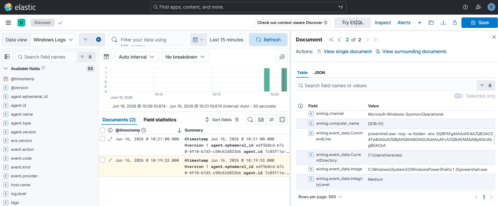
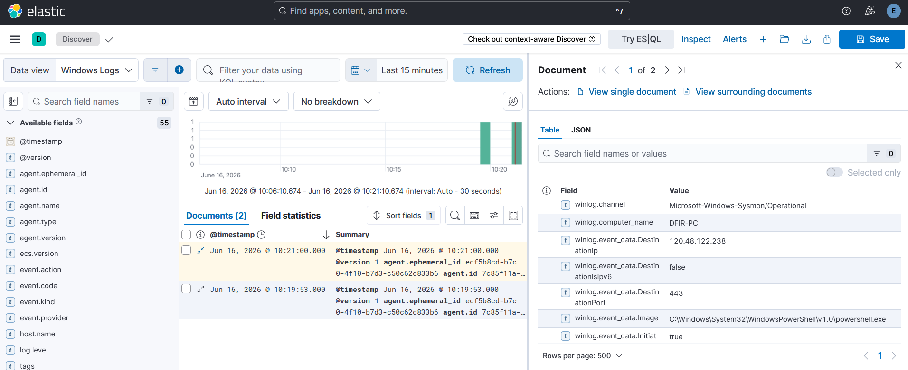
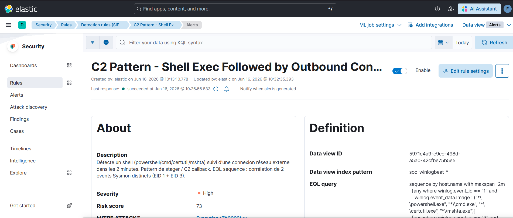
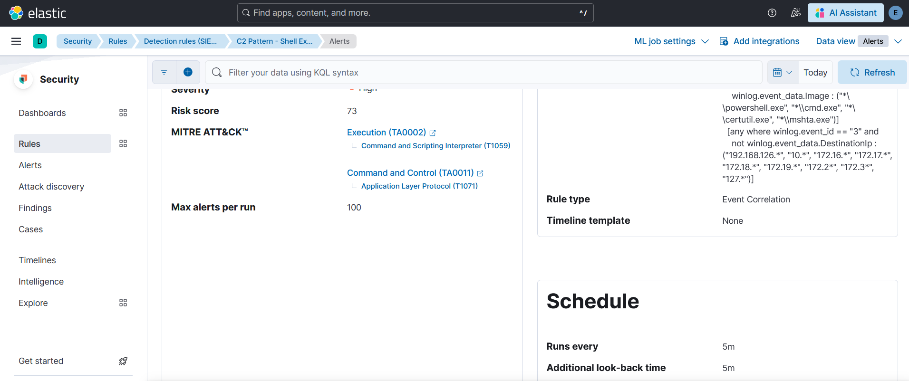

# Cas 06 - Chaîne C2 : shell suivi d'une connexion sortante + IOC match

## Technique ATT&CK

- **T1059** - Command and Scripting Interpreter (Execution, TA0002)
- **T1071** - Application Layer Protocol (Command and Control, TA0011)

## Hypothèse de détection

Un stager C2 suit typiquement un pattern en deux temps : exécution d'un shell (PowerShell, cmd, certutil, mshta) pour télécharger et lancer un payload, immédiatement suivi d'une connexion réseau sortante vers une IP externe. Pris isolément, chacun de ces events est banal. Corrélés dans une fenêtre de temps courte sur le même hôte, ils constituent un pattern fortement suspect.

En parallèle, si l'IP de destination est connue dans une base de threat intelligence (ici un feed MISP), une règle de type Indicator Match peut déclencher indépendamment.

L'hypothèse : la séquence `[process shell] → [connexion réseau externe]` dans une fenêtre de 2 minutes sur le même hôte est un indicateur de stager C2, confirmé si l'IP destination est un IOC connu.

## Data source

Deux event types Sysmon corrélés :

- **Event ID Sysmon 1** - Process Create (shell)
  - Champ : `winlog.event_data.Image`
- **Event ID Sysmon 3** - Network Connection
  - Champ : `winlog.event_data.DestinationIp`

C'est le seul cas de ces six où deux events **distincts** doivent être mis en relation. Une requête KQL ou une règle EQL `any where` (mono-event) ne peut pas exprimer cette corrélation temporelle entre EID 1 et EID 3 - EQL avec `sequence` est ici réellement nécessaire. C'est la différence concrète avec le Cas 03 (où parent et enfant étaient dans le même event EID 1).

## Méthode de test

Test réalisé par **injection synthétique de deux logs Sysmon distincts** dans Elasticsearch, dans l'ordre chronologique et sur le même `host.name`, de façon à satisfaire la séquence EQL avec `maxspan=2m`.

**Injection 1 - Sysmon EID 1 (Process Create) :**

```bash
TIMESTAMP1=$(date -u +%Y-%m-%dT%H:%M:%S.000Z)

curl -s -X POST "https://localhost:9200/soc-winlogbeat-test/_doc" \
  -H "Content-Type: application/json" \
  -u "elastic:<ELASTIC_PASSWORD>" \
  --cacert /etc/elasticsearch/certs/http_ca.crt \
  -d '{
    "@timestamp": "'"$TIMESTAMP1"'",
    "winlog": {
      "channel": "Microsoft-Windows-Sysmon/Operational",
      "event_id": "1",
      "computer_name": "DFIR-PC",
      "event_data": {
        "Image": "C:\\Windows\\System32\\WindowsPowerShell\\v1.0\\powershell.exe",
        "CommandLine": "powershell.exe -NoProfile -ExecutionPolicy Bypass -EncodedCommand JABj..."
      }
    },
    "agent": { "name": "DFIR-PC" },
    "host": { "name": "DFIR-PC" }
  }'
```

**Injection 2 - Sysmon EID 3 (Network Connection), quelques secondes après :**

```bash
curl -s -X POST "https://localhost:9200/soc-winlogbeat-test/_doc" \
  -H "Content-Type: application/json" \
  -u "elastic:<ELASTIC_PASSWORD>" \
  --cacert /etc/elasticsearch/certs/http_ca.crt \
  -d '{
    "@timestamp": "'"$(date -u +%Y-%m-%dT%H:%M:%S.000Z)"'",
    "winlog": {
      "channel": "Microsoft-Windows-Sysmon/Operational",
      "event_id": "3",
      "computer_name": "DFIR-PC",
      "event_data": {
        "Image": "C:\\Windows\\System32\\WindowsPowerShell\\v1.0\\powershell.exe",
        "DestinationIp": "120.48.122.238",
        "DestinationPort": "443",
        "Initiated": "true"
      }
    },
    "agent": { "name": "DFIR-PC" },
    "host": { "name": "DFIR-PC" }
  }'
```

L'IP `120.48.122.238` est enregistrée comme IOC dans le feed MISP connecté au lab, ce qui permet de valider simultanément la règle EQL séquence et la règle Indicator Match.

## Vérification dans Discover

Les deux events sont visibles dans Kibana Discover, horodatés à quelques secondes d'intervalle sur le même hôte.





## Règle custom - EQL sequence

Nom : **C2 Pattern - Shell Exec Followed by Outbound Connection**

```eql
sequence by host.name with maxspan=2m
  [process where winlog.event_id == "1" and
   winlog.event_data.Image : (
     "*\\powershell.exe",
     "*\\cmd.exe",
     "*\\certutil.exe",
     "*\\mshta.exe"
   )
  ]
  [any where winlog.event_id == "3" and
   not winlog.event_data.DestinationIp : (
     "192.168.126.*",
     "10.*",
     "172.16.*", "172.17.*", "172.18.*", "172.19.*",
     "172.2.*", "172.3.*",
     "127.*"
   )
  ]
```

- **Langage** : EQL
- **Rule type** : Event Correlation
- **Severity** : High
- **Risk score** : 73
- **Index pattern** : `soc-winlogbeat*`

La clause `not winlog.event_data.DestinationIp` exclut les plages RFC 1918 et loopback pour ne retenir que les connexions vers Internet.





## Règle complémentaire - Indicator Match (MISP)

Une seconde règle de type **Indicator Match** est configurée dans le lab, alimentée par un feed MISP via l'intégration Elastic SIEM ([Cas 05](../case-05-misp-indicator-match/README.md)). Elle vérifie si `winlog.event_data.DestinationIp` (events EID 3) correspond à un IOC réseau connu. Cette règle s'est déclenchée indépendamment sur l'IP `120.48.122.238` utilisée dans le test.

## Validation

Les deux règles ont généré des alertes : 1 alerte High pour la règle EQL séquence (`C2 Pattern - Shell Exec Followed by Outbound Connection`) et 1 alerte pour la règle Indicator Match (`MISP IoC Match - Sysmon Network...`).


## Limites et contournements

**`maxspan=2m` est arbitraire.** Un attaquant patient qui introduit un délai de plus de 2 minutes entre l'exécution du shell et la première connexion réseau (ex. beacon de 5 min, `Start-Sleep`) échappe à la règle. Augmenter la fenêtre réduit ce risque mais augmente le nombre de séquences innocentes (shell ouvert par un admin puis activité réseau non liée). Il n'y a pas de valeur correcte universelle : ce paramètre doit être calibré en fonction des comportements légitimes observés sur le parc cible.

**L'Indicator Match ne détecte que des IOCs déjà connus.** C'est la limite fondamentale du renseignement sur les indicateurs par IOC : une infrastructure C2 fraîchement déployée ou un domaine généré algorithmiquement (DGA) ne sera jamais dans aucun feed au moment de l'attaque. Cette règle offre une couverture rétrospective utile (attaquants réutilisant de l'infra connue) mais aucune valeur contre des campagnes ciblées avec de l'infra dédiée. La complémentarité avec la règle comportementale (EQL séquence) est justement là pour couvrir ce gap.

**Liste de shells fermée.** La requête EQL filtre sur quatre binaires (`powershell.exe`, `cmd.exe`, `certutil.exe`, `mshta.exe`). D'autres vecteurs d'exécution (`wscript.exe`, `cscript.exe`, `rundll32.exe`, `regsvr32.exe`, un binaire custom) ne seraient pas couverts. Élargir la liste augmente le risque de faux positifs.

**Pas de validation de l'IP par réputation.** La règle exclut les plages privées mais ne fait pas de distinction entre une connexion vers `8.8.8.8` (DNS Google, bénin) et `120.48.122.238` (IOC). Pour une détection comportementale, un filtre supplémentaire sur le port de destination (80, 443, 8080, 4444) ou sur la fréquence des connexions renforcerait la précision.
